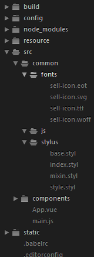
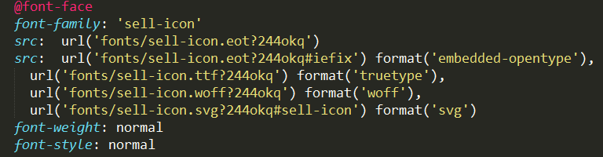

## vue引入svg生成的字体图标出现的----文件路径问题
>　This dependency(ies) was(were) not found in node_modules ？？？
** 
### 项目路径为：

1. 在`main.js`中引入`import 'common/stylus/index.styl'`
------- git bash报错`This dependency was not found in node_modules:
	    common/stylus/index.styl`，理解为：在`node_modules`文件夹中找不到该文件？？？， 为啥到node_model中找，不是指明路径了？ 然后开始百度谷歌This dependency was not found in node_modules的原因。无果。
-------- 还是浏览器帮了忙，因为chrome：`in ./src/main.js
	Module not found: Error: Can't resolve 'common/stylus/index.styl' in 'F:\NodeJS\vuep\src'`
	好吧，原来是在src目录找不到，将其改为`import './common/stylus/index.styl'`解决，当前目录 
2. 同时还有另一个相同的问题，是在引入svg生成的font图标时，
   
##### git bash: these dependencies were not found in node_modules， 
       Did you forget to run npm install --save for them? 
      好有迷惑性，就开始分析node_modules......
##### chrome:  
Module not found: Error: Can't resolve './fonts/sell-icon.eot?244okq' in  'F:\NodeJS\vuep\src\common\stylus'
原来他是在`rc\common\stylus`中找不到文件 
解决方法： 将font的目录改为上一级目录 `'../fonts/...'`

## 还掉进路由配置的一个坑里 
** 在创建项目时候，vue-router 选择了yes,自动生成了router文件夹 
   就以为路由都是在这里面配置的，将路由配置全写里面，然后各种报错。
   前前后后重新vue init将近十多个project，都是到同一步出错。
   只能到GitHub上找vue-router相关项目查看前辈怎么配置的路由。
1.在main.js中配置路由
2.在结尾`
const app = new Vue({
	router: router,
	render: h => h(App)
}).$mount('#app')
` 
后添加export default app 解决了问题app is assigned but not used的问题
ps: 看到好多项目多不需要，原因待了解。
